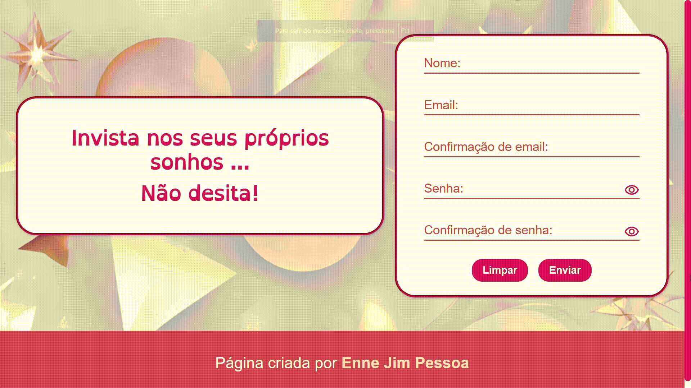

# 💖 Formulário

 Um site web com um formulário simples pedindo nome, email e senha, e tem um botão de resetar todos os campos de preenchimento além do botão de enviar. Essa página é mais concentrada em validação de dados.


## 🌐 Aplicação Hospedada

 [Clique aqui para acessar o website](https://enne-amore.github.io/formulario/)


## 🎞️ Pré-visualização

 


## ⚡ Funcionalidades
 
 - Mais acessibilidade usando a tecla "tab"
 - Efeitos de "hover" e de "active" nos elementos clicáveis
 - Validação de dados
 - Botão de resetar todos os campos de preenchimento


## 🚀 Tecnologias Utilizadas

 <p align="left">
   
   
   
 </p>


## 🛠️ Instalação Local

 1. **Clone o repositório**
 
 No terminal, rode o seguinte comando:
 
 ```bash
 git clone https://github.com/Enne-Amore/formulario.git
 ```
 
 2. **Entre no arquivo "index.html"**
 
 3. **Rode o arquivo principal de renderização:**
 
 Clique com o botão direito do mouse e selecione a seguinte opção:
 
 ```bash
 Open with Live Server
 ```


## 📂 Estrutura do Projeto

 ```plaintext
 formulario/
 ├── css/                    # Arquivos CSS
 │   ├── reset.css       
 │   ├── responsive.css  
 │   ├── style.css       
 ├── docs/                   # Arquivos de documentação do projeto
 │   ├── autorias.txt
 │   ├── preview.mp4
 ├── fonts/                  # Arquivos das fontes utilizadas  
 │   ├── open-dyslexic.ttf
 ├── img/                    # Imagens utilizadas  
 │   ├── fundo.png  
 │   ├── icone.png
 │   ├── preview.gif
 ├── js/                     # Arquivos JavaScript
 │   ├── form-validacao.js
 │   ├── ver-senha.js
 ├── index.html              # Arquivo principal de renderização
 ├── README.md
 ```


## 🌈 Cores

 | Cor             | Hexadecimal |
 | --------------- | ----------- |
 | Rosa Escura     | `#D40C6A`   |
 | Rosa Clara      | `#FF97A8`   |
 | Vermelha Escura | `#D5405E`   |
 | Vermelha Clara  | `#FEE3E8`   |


## 🔤 Fontes Tipográficas

 - **Open Dyslexic**  
   Exemplo de uso:  
   `font-family: "Open Dyslexic";` ou 
   `font-family: var(--texto);`
 - **Arial, Helvetica, Sans-Serif**  
   Exemplo de uso:  
   `font-family: Arial, Helvetica, sans-serif;` ou 
   `font-family: var(--padrao);`


## 🌟 Referências de Uso

 - [Freepik](https://www.freepik.com)
 - [www.flaticon.com'](https://www.flaticon.com/br/)
 - [Ícones De Olho](https://fonts.googleapis.com/css2?family=Material+Symbols+Outlined:opsz,wght,FILL,GRAD@24,400,0,0)


## 🔧 Suporte

 Para me contatar como suporte, o meu email é [Enne.Pessoa@gmail.com](mailto:Enne.Pessoa@gmail.com)

